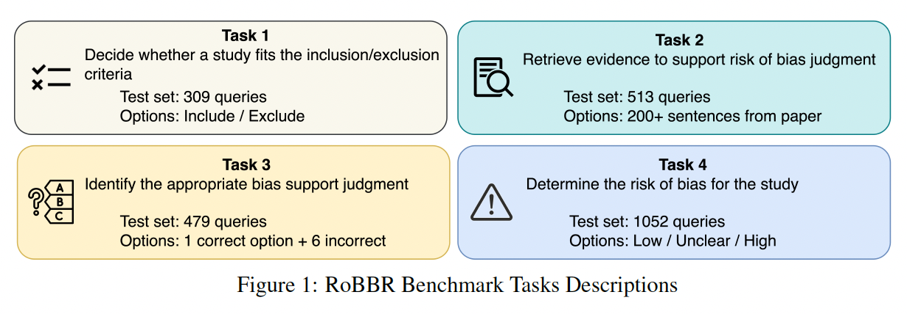

# Welcome to the RoBBR Benchmark

  

## Understanding Risk of Bias Judgments

Risk of bias judgments are critical evaluations made within biomedical research to assess the potential for bias in the conduct and reporting of scientific studies. These judgments help determine the reliability of study findings by identifying biases that might affect the outcomes, such as selection bias, reporting bias, and others.

## What is RoBBR?

The **RoBBR Benchmark** is designed to evaluate artificial intelligence models on their ability to assess risks of bias in biomedical research. This benchmark is essential for developing automated systems that critically appraise the methodological quality and bias in scientific literature, crucial for evidence-based medicine.

## Why RoBBR?

- **Expert-Validated**: Built using expert annotations based on the Cochrane risk of bias framework, ensuring robustness and relevance.
- **Impactful**: By facilitating accurate bias assessment, RoBBR aids in improving the quality and trustworthiness of systematic reviews and meta-analyses in healthcare.
- **Task-Specific Design**: The benchmark uniquely utilizes three specific tasks to measure different capabilities essential for evaluating risk of bias.
- **Data from Over 500 Papers**: The benchmark features a comprehensive set of more than 500 biomedical papers, providing a broad base for robust model training and evaluation.
- **Expert Annotations**: Over 2000 bias annotations have been meticulously crafted by experts, ensuring detailed and accurate benchmarks.

Learn about the specific tasks and metrics used to measure model performance in the [Task Details](./task_details) and [Dataset and Evaluation Metrics](./dataset_and_evaluation) sections.

> **Note:** See [RoBBR Structure](./structure) for specific details about the RoBBR benchmark structure.
